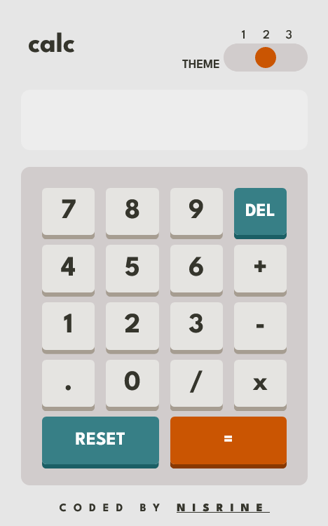

# Frontend Mentor - Calculator app solution

This is a solution to the [Calculator app challenge on Frontend Mentor](https://www.frontendmentor.io/challenges/calculator-app-9lteq5N29). 

## Table of contents

- [Overview](#overview)
  - [Screenshot](#screenshot)
  - [Links](#links)
- [My process](#my-process)
  - [Built with](#built-with)
- [Author](#author)

### Screenshot
Desktop -- Theme 1

Desktop -- Theme 2

Desktop -- Theme 3

Mobile -- Theme 1

Mobile -- Theme 2

Mobile -- Theme 3

### Links

- [Solution URL](https://www.frontendmentor.io/solutions/responsive-calculator-app-with-custom-themes-built-with-cssjavascript-SPcQr0m6vr)
- [Live Site URL](https://nisrine-c.github.io/calculator-app.github.io/)

## My process

### Built with

- Semantic HTML5 markup
- CSS custom properties
- Flexbox
- CSS Grid
- CSS properties
- Mobile-first workflow

## Author

- Website - [Nisrine](https://github.com/Nisrine-C)
- Frontend Mentor - [@Nisrine-C](https://www.frontendmentor.io/profile/Nisrine-C)
